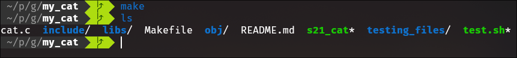
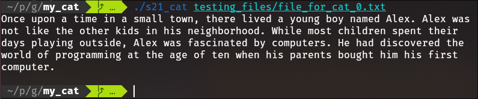
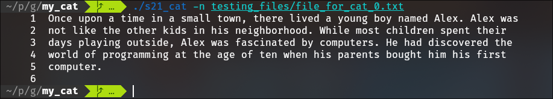
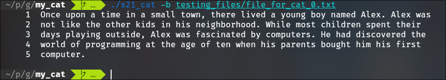
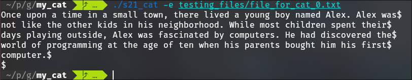

# my_cat
I implemented my cat in C language

- to compile: `make`



- all flags:

| No. | Options | Description |
| ------ | ------ | ------ |
| 1 | -b (GNU: --number-nonblank) | numbers only non-empty lines |
| 2 | -e implies -v (GNU only: -E the same, but without implying -v) | but also display end-of-line characters as $  |
| 3 | -n (GNU: --number) | number all output lines |
| 4 | -s (GNU: --squeeze-blank) | squeeze multiple adjacent blank lines |
| 5 | -t implies -v (GNU: -T the same, but without implying -v) | but also display tabs as ^I  |

- Usage of cat:

```
cat [OPTION] [FILE]...
```

- example of work:








